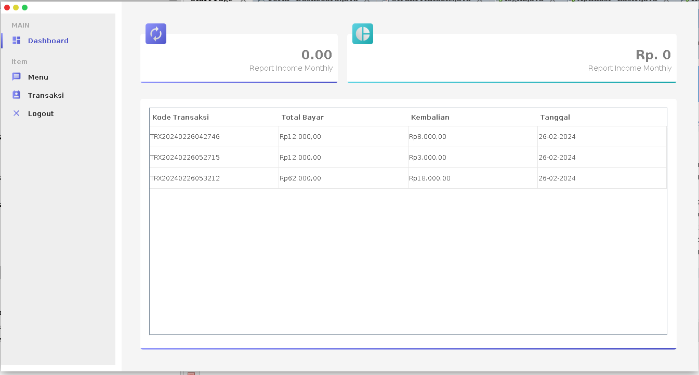

# Aplikasi Kasir Restorant

Aplikasi kasir ini dibangun menggunakan Java Swing dan MySQL sebagai database. Dengan antarmuka pengguna yang ramah, aplikasi ini dirancang untuk memudahkan proses kasir di berbagai jenis bisnis.

## Fitur Utama
- Login dan Logout User
- Manajemen inventaris produk
- Input Menu Dan Transaksi
- Validasi duplikat input konten
- Riwayat transaksi dan laporan penjualan

## Cara Menggunakan
1. Buka aplikasi melalui NetBeans atau eksekusi file JAR.
2. Masukkan kredensial database MySQL.
3. Tambahkan produk ke inventaris.
4. Mulai melakukan transaksi penjualan.

